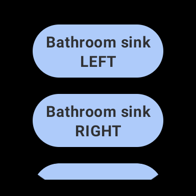

# Hue Smart Light Controller for Wear OS
Standalone Wear OS app using Compose Navigation and Kotlin. Controls Philips Hue lights directly from the watch, without requiring a phone companion app. Uses Dagger/Hilt for dependency injection.
Implemented authentication with the Hue hub (using the [Shade library](https://github.com/InkApplications/Shade)) and direct control of lights via WiFi.
Developed a user-friendly interface tailored for the Wear OS environment, ensuring intuitive and efficient light management.

 
